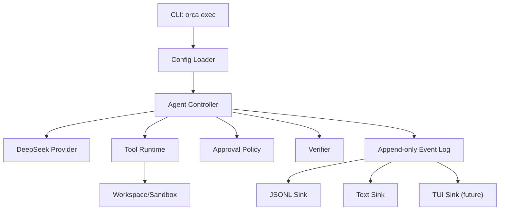

# 系统架构文档: Orca Codex-Style Harness

## 摘要
- **架构模式**: Rust 单体 CLI，内部按 runtime/controller/provider/tools/events 分层。
- **技术栈**: Rust 2024、Tokio async runtime、Clap CLI、Serde JSON、tracing、可选 Ratatui/Crossterm TUI 后续接入。
- **核心设计决策**:
  - 以 `orca exec` headless contract 作为第一等边界。
  - 所有 agent 行为先产生日志事件，再渲染为 text/jsonl/TUI。
  - DeepSeek reasoning/tool-use 在事件模型和上下文模型中独立建模。
- **主要风险**: DeepSeek thinking/tool-call 协议变化、工具接口可用性、approval 非交互策略、安全 sandbox 扩展。
- **项目结构**: 先保持单 crate，后续按需要拆 workspace。

---

## 1. 技术调研
### 1.1 社区范式
- Codex CLI/codex-rs 证明 Rust 本地 CLI/TUI runtime 是合理主线。
- Claude Code SDK/headless 说明 permission policy 必须可程序化，而不是交互提示的副产物。
- SWE-agent 的 ACI 经验说明工具形态会直接影响 agent 成功率。
- SWE-bench、Terminal-Bench、OpenHands 说明 evaluation harness 通常包含 environment、task、verifier、budget、trace、metrics。

### 1.2 结论
Orca 第一版应把 harness 视为 runtime 外部协议，而不是后期 eval 插件。`exec` 的输入、事件、权限、预算、验证和退出码共同构成稳定 contract。

## 2. 架构概述


### 2.1 分层
- **cli**: 参数解析、stdin、cwd、退出码。
- **config**: 模型、API key、approval policy、预算、输出格式。
- **runtime**: session、turn、event log、budget、resume。
- **agent**: explore/plan/execute/verify loop。
- **provider**: DeepSeek chat/thinking/tool-call 协议适配。
- **tools**: read/list/grep/edit/bash/git 等 ACI 工具。
- **approval**: 操作分类、policy 决策、request/resolved 事件。
- **verification**: verifier 命令、验证结果、最终状态。
- **event**: 版本化事件 schema 与 jsonl 输出。

## 3. 目录结构
```text
src/
  main.rs
  cli.rs
  config.rs
  error.rs
  event/
    mod.rs
    schema.rs
    sink.rs
  runtime/
    mod.rs
    controller.rs
    budget.rs
    session.rs
  provider/
    mod.rs
    deepseek.rs
  approval/
    mod.rs
    policy.rs
  tools/
    mod.rs
    read_file.rs
    list_files.rs
    grep.rs
    edit.rs
    bash.rs
    git.rs
  verification/
    mod.rs
tests/
  exec_jsonl.rs
  approval_contract.rs
```

第一版可以按任务逐步创建，不需要一次性落满全部模块。

## 4. 数据模型
### 4.1 EventEnvelope
```text
version: string
run_id: string
seq: u64
timestamp: string
type: EventType
payload: object
```

### 4.2 RunStatus
```text
success
failed
cancelled
approval_required
verification_failed
budget_exhausted
```

### 4.3 ApprovalMode
```text
read-only
workspace-write
full-auto
```

### 4.4 ToolStatus
```text
requested
completed
failed
denied
```

## 5. API / CLI 设计
### 5.1 Exec
```sh
orca exec [options] <prompt>
```

选项:
- `--output-format jsonl|text`
- `--cwd <path>`
- `--approval-mode read-only|workspace-write|full-auto`
- `--max-turns <n>`
- `--timeout <duration>`
- `--verifier <command>`

### 5.2 退出码
- `0`: success
- `1`: failed
- `2`: verification_failed
- `3`: approval_required 或 denied 后 abort
- `4`: budget_exhausted
- `64`: CLI usage/config error

## 6. 安全设计
- shell/edit 默认经过 approval policy。
- `read-only` 禁止写文件和执行变更类命令。
- `workspace-write` 仅允许 workspace 内写入。
- `full-auto` 仍记录所有高风险操作事件。
- 后续 sandbox 接口支持本地、Docker、远程 runner。

## 7. 基础设施
- 第一版不做部署。
- CI 建议包含 `cargo fmt --check`、`cargo check`、`cargo test`。
- JSONL contract 测试作为核心回归。

## 8. 技术风险
| 风险 | 等级 | 缓解措施 |
|------|------|----------|
| DeepSeek thinking/tool-call 协议演进 | 高 | provider 层隔离，event schema 保留 reasoning/tool-use 独立字段 |
| 工具返回不适合模型 | 高 | 工具 contract 测试覆盖空输出、截断、失败、超时 |
| approval 非交互策略混乱 | 中 | policy 明确化，所有决策进入事件流 |
| JSONL schema 过早锁死 | 中 | envelope 版本化，payload 按事件类型演进 |
| sandbox 后续接入成本 | 中 | 第一版保留 environment policy 字段 |

