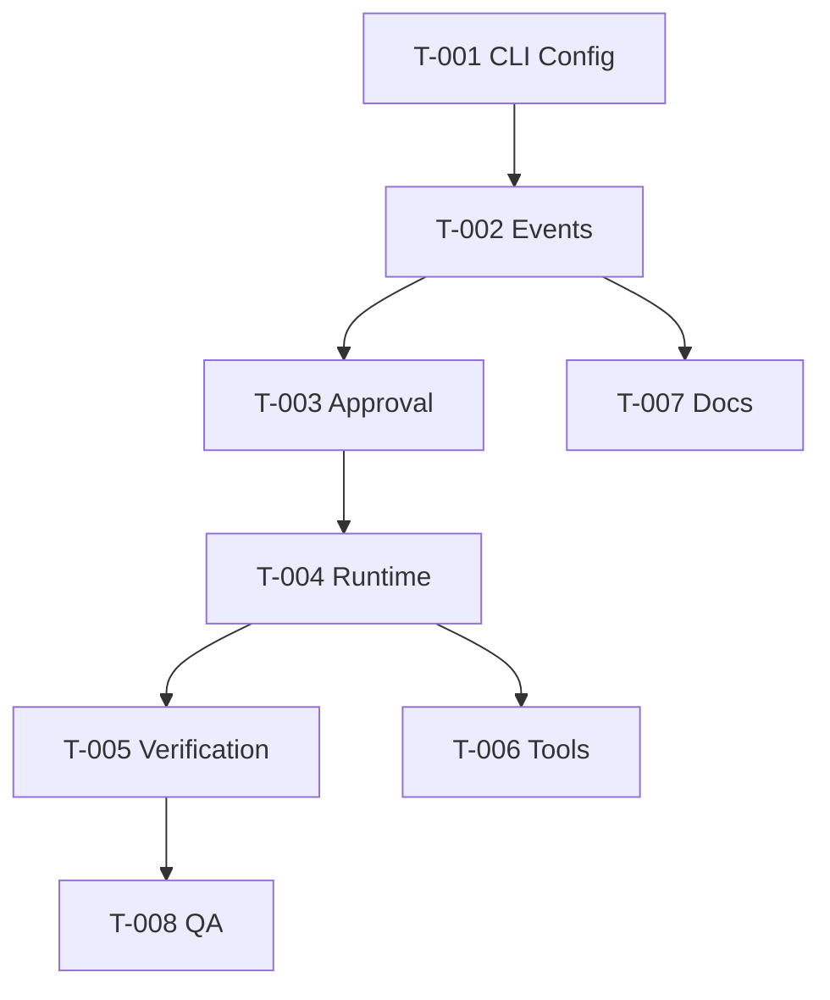

# 开发任务规格文档

## 摘要
- **任务总数**: 8 个
- **前端任务**: 0 个
- **后端/Runtime 任务**: 8 个
- **关键路径**: T-001 → T-002 → T-003 → T-004 → T-005 → T-006
- **预估复杂度**: 中
- **Blast Radius**: 中
- **风险确认触发项**: 需确认: 计划新增/修改约 13 个文件，修改 `Cargo.toml` 和 `Cargo.lock`，需要新增 Rust 依赖。

---

## Repo Preflight
- Git: 默认分支 `main`，当前分支 `main`，当前有未提交 `.boss/` 文档。
- CI: `.github/workflows/` 不存在；其他 CI 配置 unknown。
- 包管理与脚本: Rust Cargo；现有可用命令 `cargo fmt --check`、`cargo check`，测试脚本尚未配置。
- 测试工具: Rust 内置 test harness；尚无测试文件。
- 契约来源: 当前只有 `Cargo.toml`、`README.md`、`src/main.rs`；event schema 尚未实现。
- 业务常量: unknown；本 feature 将新增 RunStatus、ApprovalMode、EventType 等 contract enum。
- 路由与迁移: 不适用；无数据迁移。
- 已检查命令/文件: `git status --short --branch`、`Cargo.toml`、`README.md`、`src/main.rs`、Blade `packages/cli/src/commands/headless.ts`。

## 故事引用
- **Story ID**: ORCA-HARNESS-001
- **故事标题**: Codex-style headless harness contract

## Contract Matrix
| ID | Contract | UI / Copy | Client Payload | Server Schema | Persistence | Business Rule | Test Evidence |
|----|----------|-----------|----------------|---------------|-------------|---------------|---------------|
| C-001 | `orca exec` 输出 JSONL | CLI help 包含 exec/options | prompt/cwd/output-format | EventEnvelope | stdout | JSONL 一行一个 JSON | `tests/exec_jsonl.rs` |
| C-002 | approval request 可程序化决策 | 文案不阻塞 headless | approval-mode | ApprovalMode | event log | read-only 禁止写入 | `tests/approval_contract.rs` |
| C-003 | final status 与退出码一致 | final line/status | RunStatus | RunStatus enum | session.completed | verification_failed 不等于 success | `tests/exec_jsonl.rs` |
| C-004 | reasoning 与普通文本分离 | text 模式可折叠 thinking | assistant.reasoning.delta | EventType | event stream | DeepSeek 状态不丢失 | `tests/exec_jsonl.rs` |

## Evidence Waves
### Wave 1: Harness contract skeleton
- **范围**: CLI exec、event schema、JSONL sink、approval mode、mock runtime。
- **文件 owner**: T-001/T-002 owner event/cli/config；T-003 owner approval；T-004 owner runtime。
- **红测**: 先创建 `tests/exec_jsonl.rs` 和 `tests/approval_contract.rs`，断言当前占位 CLI 不满足 contract。
- **绿门禁**: `cargo fmt --check && cargo test && cargo check`。
- **Stop Condition**: `orca exec --output-format jsonl "hello"` 必须输出合法 JSONL，且 `session.completed.status` 与退出码一致。

### Wave 2: Core ACI tool contract
- **范围**: read/list/grep/bash/edit/git_status 的接口定义和 mock/最小实现。
- **红测**: 工具 contract 测试覆盖空输出、失败、截断、approval denied。
- **绿门禁**: `cargo fmt --check && cargo test && cargo check`。
- **Stop Condition**: 工具事件能完整表达 request/completed/failed/denied。

## 任务列表
### Task T-001: [BE] 创建 CLI 与 Config 模块
**类型**: 创建/修改

**文件输出列表 / 写集**:
| 文件路径 | 操作 | 写集风险 | owner | 说明 |
|----------|------|----------|-------|------|
| `Cargo.toml` | 修改 | 共享文件 | T-001 | 新增 clap/serde/tokio 等依赖 |
| `Cargo.lock` | 修改 | 共享文件 | T-001 | Cargo 自动更新 |
| `src/main.rs` | 修改 | 共享文件 | T-001 | 切到 cli 模块 |
| `src/cli.rs` | 创建 | 独占 | T-001 | 参数解析 |
| `src/config.rs` | 创建 | 独占 | T-001 | Runtime config |

**实现步骤**:
1. 使用 clap 定义 `orca exec`、`--output-format`、`--cwd`、`--approval-mode`、`--max-turns`、`--verifier`。
2. 将 CLI args 转为 `RunConfig`。

**测试用例**:
- `orca --help` 包含 exec。
- `orca exec --output-format jsonl "hello"` 能进入 runtime。

**复杂度**: 中  
**依赖**: 无

### Task T-002: [BE] 创建 Event Schema 与 JSONL Sink
**类型**: 创建

**文件输出列表 / 写集**:
| 文件路径 | 操作 | 写集风险 | owner | 说明 |
|----------|------|----------|-------|------|
| `src/event/mod.rs` | 创建 | 共享文件 | T-002 | event 模块入口 |
| `src/event/schema.rs` | 创建 | 独占 | T-002 | EventEnvelope/EventType |
| `src/event/sink.rs` | 创建 | 独占 | T-002 | JSONL/text sink |
| `tests/exec_jsonl.rs` | 创建 | 共享文件 | T-002 | contract 测试 |

**实现步骤**:
1. 定义 EventEnvelope、RunStatus、EventPayload。
2. 实现 stdout JSONL sink。
3. 测试每一行都是合法 JSON。

**复杂度**: 中  
**依赖**: T-001

### Task T-003: [BE] 创建 Approval Policy
**类型**: 创建

**文件输出列表 / 写集**:
| 文件路径 | 操作 | 写集风险 | owner | 说明 |
|----------|------|----------|-------|------|
| `src/approval/mod.rs` | 创建 | 共享文件 | T-003 | approval 模块入口 |
| `src/approval/policy.rs` | 创建 | 独占 | T-003 | approval mode 和决策 |
| `tests/approval_contract.rs` | 创建 | 共享文件 | T-003 | approval contract 测试 |

**实现步骤**:
1. 定义 ApprovalMode、ActionKind、ApprovalDecision。
2. read-only 禁止 write/shell mutating action。
3. 输出 approval requested/resolved 事件。

**复杂度**: 中  
**依赖**: T-002

### Task T-004: [BE] 创建 Mock Runtime Controller
**类型**: 创建

**文件输出列表 / 写集**:
| 文件路径 | 操作 | 写集风险 | owner | 说明 |
|----------|------|----------|-------|------|
| `src/runtime/mod.rs` | 创建 | 共享文件 | T-004 | runtime 模块入口 |
| `src/runtime/controller.rs` | 创建 | 独占 | T-004 | mock agent loop |
| `src/runtime/budget.rs` | 创建 | 独占 | T-004 | turns/time budget |
| `src/runtime/session.rs` | 创建 | 独占 | T-004 | run id/session |
| `tests/exec_jsonl.rs` | 修改 | 共享文件 | T-004 | 补 final status 断言 |

**实现步骤**:
1. mock controller 输出 session.started、turn.started、assistant.reasoning.delta、assistant.message.delta、session.completed。
2. 根据状态返回退出码。

**复杂度**: 中  
**依赖**: T-003

### Task T-005: [BE] 创建 Verification Contract
**类型**: 创建

**文件输出列表 / 写集**:
| 文件路径 | 操作 | 写集风险 | owner | 说明 |
|----------|------|----------|-------|------|
| `src/verification/mod.rs` | 创建 | 独占 | T-005 | verifier 命令 contract |
| `tests/exec_jsonl.rs` | 修改 | 共享文件 | T-005 | verification status 测试 |

**实现步骤**:
1. 支持 `--verifier <command>` 占位执行或 mock 执行。
2. 输出 verification.started/completed。
3. verifier 失败映射为 exit code 2。

**复杂度**: 中  
**依赖**: T-004

### Task T-006: [BE] 创建 Core Tool Contract Skeleton
**类型**: 创建

**文件输出列表 / 写集**:
| 文件路径 | 操作 | 写集风险 | owner | 说明 |
|----------|------|----------|-------|------|
| `src/tools/mod.rs` | 创建 | 共享文件 | T-006 | tool trait 和 registry |
| `src/tools/read_file.rs` | 创建 | 独占 | T-006 | read_file skeleton |
| `src/tools/list_files.rs` | 创建 | 独占 | T-006 | list_files skeleton |
| `src/tools/grep.rs` | 创建 | 独占 | T-006 | grep skeleton |
| `src/tools/bash.rs` | 创建 | 独占 | T-006 | bash skeleton |
| `src/tools/edit.rs` | 创建 | 独占 | T-006 | edit skeleton |
| `src/tools/git.rs` | 创建 | 独占 | T-006 | git_status skeleton |

**实现步骤**:
1. 定义 ToolRequest、ToolResult、ToolStatus。
2. 先实现最小 read/list/git_status，其他工具返回明确 not_implemented。

**复杂度**: 高  
**依赖**: T-004

### Task T-007: [BE] 更新 README 与 harness contract 文档
**类型**: 修改/创建

**文件输出列表 / 写集**:
| 文件路径 | 操作 | 写集风险 | owner | 说明 |
|----------|------|----------|-------|------|
| `README.md` | 修改 | 共享文件 | T-007 | 说明 exec/jsonl/approval |
| `docs/harness-contract.md` | 创建 | 独占 | T-007 | 事件与退出码 contract |

**复杂度**: 低  
**依赖**: T-002

### Task T-008: [BE] 质量门禁与回归测试
**类型**: 修改

**文件输出列表 / 写集**:
| 文件路径 | 操作 | 写集风险 | owner | 说明 |
|----------|------|----------|-------|------|
| `tests/exec_jsonl.rs` | 修改 | 共享文件 | T-008 | 补充 CLI smoke |
| `tests/approval_contract.rs` | 修改 | 共享文件 | T-008 | 补充 denied/allowed |

**复杂度**: 低  
**依赖**: T-001,T-002,T-003,T-004,T-005

## 任务依赖图

## 并行安全组
| 并行安全组 | 可并行任务 | 串行前置 | 写集约束 |
|------------|------------|----------|----------|
| Group-A | T-001 | 无 | 修改 Cargo/main，共享 owner T-001 |
| Group-B | T-002 | Group-A | 创建 event/schema/tests |
| Group-C | T-003 | Group-B | approval 独占，tests 与 T-002 串行 |
| Group-D | T-004 | Group-C | runtime 独占，tests 与前置串行 |
| Group-E | T-005, T-007 | Group-D | T-005 修改 tests；T-007 修改 README/docs，可并行 |
| Group-F | T-006 | Group-D | tools 独占 |
| Group-G | T-008 | Group-E, Group-F | 统一补测试 |

## 实现前检查清单
- [ ] 用户确认新增依赖和修改 `Cargo.toml`/`Cargo.lock`。
- [ ] 先写红测，再实现 contract。
- [ ] 每个 Wave 结束运行 `cargo fmt --check && cargo test && cargo check`。
- [ ] JSONL 事件不能手写散落，必须来自统一 event schema。
