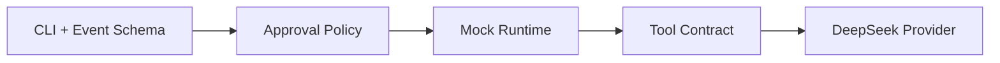

# 技术方案评审报告

## 1. 评审概述
- **项目名称**: Orca Codex-Style Harness
- **评审日期**: 2026-06-05
- **评审人**: Tech Lead Agent
- **评审文档**:
  - PRD: `.boss/orca-codex-harness/prd.md`
  - 架构: `.boss/orca-codex-harness/architecture.md`

## 摘要
- **评审结论**: ✅ 通过
- **主要风险**: DeepSeek 协议演进、ACI 工具可用性、approval/sandbox 边界。
- **必须解决**: 第一批实现必须先落 JSONL/event/approval contract 测试，避免 runtime 随意增长。
- **建议优化**: 先做 mock provider 和 dry-run controller，再接真实 DeepSeek API。
- **技术债务**: 初期可以本地执行无 Docker sandbox，但必须在事件和 config 中保留 sandbox policy 字段。

---

## 2. 评审结论
| 维度 | 评分 | 说明 |
|------|------|------|
| 架构合理性 | ⭐⭐⭐⭐⭐ | 以 harness contract 为核心，分层清晰 |
| 技术选型 | ⭐⭐⭐⭐⭐ | Rust/Tokio/Serde/Clap 适合 CLI runtime |
| 可扩展性 | ⭐⭐⭐⭐ | 后续 TUI/MCP/ACP 可基于事件流扩展 |
| 可维护性 | ⭐⭐⭐⭐ | 需要严格控制 event schema 和工具 contract |
| 安全性 | ⭐⭐⭐⭐ | approval 设计正确，sandbox 初期仍需谨慎 |

**总体评价**: ✅ 通过

## 3. 技术风险评估
| 风险 | 等级 | 影响范围 | 缓解措施 |
|------|------|----------|----------|
| DeepSeek thinking/tool-use 细节变化 | 高 | provider 与上下文回灌 | provider 隔离，reasoning 事件独立 |
| ACI 工具设计不佳导致模型误判 | 高 | agent 成功率 | 为工具输出写 contract 测试 |
| approval mode 与外部 harness 不兼容 | 中 | CI/benchmark | 统一 request/resolved 事件和退出码 |
| 过早实现完整 TUI 分散目标 | 中 | MVP 进度 | 第一批只做 exec/jsonl/approval |
| 本地 shell 执行安全边界不足 | 中 | 用户机器 | 默认 read-only/workspace-write，危险命令需审批 |

## 4. 技术可行性分析
| 功能 | 可行性 | 复杂度 | 说明 |
|------|--------|--------|------|
| `orca exec` CLI | ✅ 可行 | S | Clap + async main |
| JSONL event sink | ✅ 可行 | S | Serde envelope |
| approval policy | ✅ 可行 | M | 需要 action classification |
| mock agent/controller | ✅ 可行 | M | 先打 contract |
| DeepSeek provider | ⚠️ 有挑战 | L | thinking/tool-call 细节需真实 API 验证 |
| sandbox | ⚠️ 有挑战 | XL | 第一版只预留 |

## 5. 架构改进建议
### 5.1 必须修改（阻塞项）
- [ ] 无。

### 5.2 建议优化（非阻塞）
- [ ] 第一批代码不要直接接真实模型，先实现 mock provider 保障 harness contract。
- [ ] 所有事件类型集中定义，避免各模块手写 JSON。
- [ ] 工具输出必须限制大小并记录截断状态。

## 6. 实施建议

| 里程碑 | 内容 | 建议工时 | 风险等级 |
|--------|------|----------|----------|
| M1 | exec/jsonl/exit code/approval contract | 1-2 天 | 低 |
| M2 | ACI core tools + mock loop | 2-4 天 | 中 |
| M3 | DeepSeek thinking/tool-call provider | 3-5 天 | 高 |

## 7. 代码规范建议
- 模块命名使用 snake_case，公开类型使用 PascalCase。
- event schema 使用 serde tagged enum 或显式 payload struct，不散落 `serde_json::json!`。
- 错误统一走 `Result<T, OrcaError>`。
- CLI 参数解析与 runtime config 分离。
- tests 优先覆盖外部 contract，而不是内部函数细节。

## 8. 评审结论
- **是否通过**: ✅ 通过
- **阻塞问题数**: 0 个
- **建议优化数**: 3 个
- **下一步行动**: 进入任务拆分，第一批实现限定为 harness contract 基础设施。

